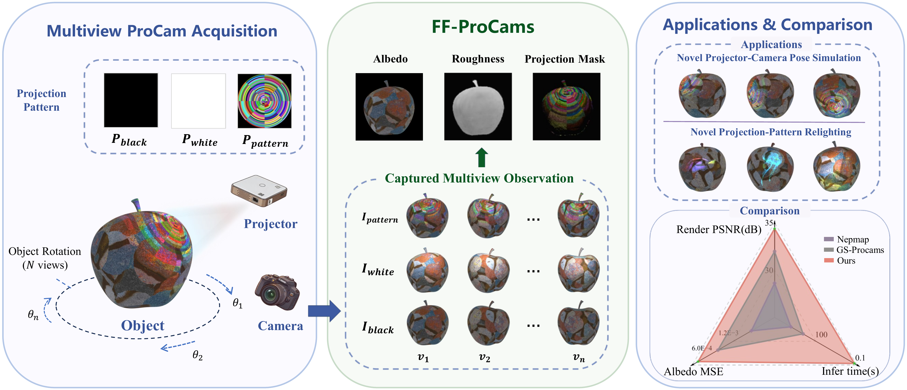

# FF-ProCams: Feed-Forward Gaussian Splatting for Projector-Camera System

<p align="center">
  
</p>

This repository currently releases the synthetic data generation pipeline used by FF-ProCams.

The provided code contains a Blender-based pipeline for generating multi-view projector-camera synthetic data. The FF-ProCams training code, evaluation scripts, pretrained models, and dataset links will be released in future updates.

## Status

- Synthetic dataset generation scripts: released
- FF-ProCams training code: coming soon
- Evaluation scripts: coming soon
- Pretrained models: coming soon
- Dataset download links: coming soon

## Roadmap

- [x] Release synthetic dataset generation pipeline
- [ ] Add detailed setup and usage examples
- [ ] Add example Blender scene and sample assets
- [ ] Add example generated data structure
- [ ] Release FF-ProCams training code
- [ ] Release evaluation scripts
- [ ] Release pretrained models
- [ ] Release dataset download links
- [ ] Add citation and license information

## Synthetic Dataset Generation

The `synthetic_dataset_generation` folder provides scripts for generating synthetic datasets using Blender and projector-camera rendering.

The pipeline renders textured 3D objects from multiple viewpoints under projected patterns. It saves RGB images, depth maps, object masks, and camera/projector pose metadata for each generated scene.

## Folder Structure

```text
synthetic_dataset_generation/
  controller_kill_after_time.py
  render_batch_both_8view_multiproj.py
  render_config.py
  render_defaults.yaml
  blender_scene.py
  orbit_renderer.py
  materials.py
  projector_patterns.py
```

## Requirements

- Blender 4.x
- Python 3

## Usage

Run the controller script from the repository root:

```bash
python synthetic_dataset_generation/controller_kill_after_time.py --start 0 --end 1
```

The controller launches Blender in background mode and runs the rendering pipeline.

The `--start` and `--end` arguments select a range of texture folders to process. This is useful for splitting dataset generation across multiple machines or GPUs.

## Output

For each texture folder and object, the pipeline creates an output folder containing rendered images and metadata.

Example output structure:

```text
textures/
  material_xxx/
    object_name/
      path_0_theta000_pattern.png
      path_0_theta000_depth.png
      path_0_theta000_mask.png
      render_poses.json
```

The generated metadata file `render_poses.json` contains camera and projector pose information for each rendered view.

## Notes

- Generated datasets can be large. Avoid committing generated images, depth maps, masks, and intermediate outputs to the repository.
- The current release focuses on synthetic data generation. Training and evaluation code will be released later.

## Citation

Citation information will be added after release.

## License

License information will be added before public release.
